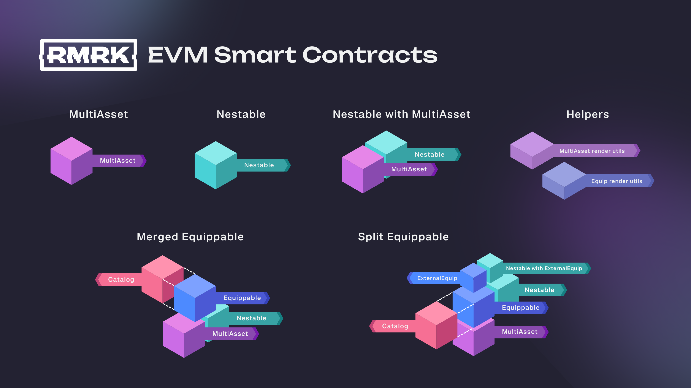

# RMRK Solidity

A set of Solidity sample contracts using the RMRK standard implementation on EVM.

## RMRK Legos

RMRK is a set of NFT standards which compose several "NFT 2.0 lego" primitives. Putting these legos together allows a
user to create NFT systems of arbitrary complexity.

There are various possibilities on how to combine these legos, all of which are ERC721 compatible:

1. MultiAsset (Context-Dependent Multi-Asset Tokens)
    - Only uses the MultiAsset RMRK lego
2. Nestable (Parent-Governed Nestable Non-Fungible Tokens)
    - Only uses the Nestable RMRK lego
3. Nestable with MultiAsset
    - Uses both Nestable and MultiAsset RMRK legos
4. Equippable MultiAsset with Nestable and Catalog
    - Merged equippable is a more compact RMRK lego composite that uses less smart contracts, but has less space for
    custom logic implementation
    - Split equippable is a more customizable RMRK lego composite that uses more smart contracts, but has more space for
    custom logic implementation

The first 3 use cases have stand alone versions with both minimal and ready to use implementations. The latter two, due
to Solidity contract size constraints, MultiAsset and Equippable logic are included in a simgle smart contract, while
Nestable and ownership are handled by either the same smart contract or a separate one. Catalog is also a separate smart
contract for practical reasons, since one Catalog can be used by multiple tokens.



## Installation

You can start using the RMRK EVM implementation smart contracts by installing the dependency to your project:

```
npm install @rmrk-team/evm-contracts
```

Once you have installed the `@rmrk-team/evm-contracts` dependency, you can refer to one of the samples residing in this
repository's [`contracts/`](./contracts/README.md) directory. The versions starting with `Simple` keyword are ready to
use; you can simply extend those for your own contracts and pass fixed or variable parameters to the constructor. The
examples starting with `Advanced` keyword showcase the implementation where you have more freedom in implementing custom
business logic. The available internal functions when building it are outlined within the examples.

For each of the lego combinations we have sample versions:

1. [`MultiAsset`](./contracts/MultiAsset/README.md)
2. [`Nestable`](./contracts/Nestable/README.md)
3. [`Nestable with MultiAsset`](./contracts/NestableMultiAsset/README.md)
4. [`MergedEquippable`](./contracts/MergedEquippable/README.md)
5. [`SplitEquippable`](./contracts/SplitEquippable/README.md)

Additionally we have render util contracts. The reason these are separate is to save contract space. You can have a single deploy of those and use them on every contract or even use the exising ones (We'll provide them in the future):

1. [`MultiAsset render utils`](@rmrk-team/evm-contracts/contracts/RMRK/utils/RMRKMultiAssetRenderUtils.sol)
provides utilities to get asset objects from IDs, and accepted or pending asset objects for a given token. The
MultiAsset lego provides only IDs for the latter.
2. [`Equip render utils`](@rmrk-team/evm-contracts/contracts/RMRK/utils/RMRKEquipRenderUtils.sol) provides the same
shorcuts on extended assets (with equip information). This utility smart contract also has views to get information
about what is currently equipped to a token and to compose equippables for a token asset.